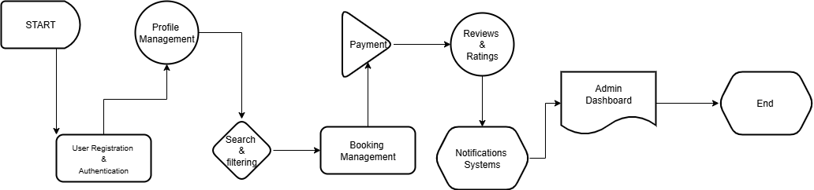

# 🏡 Airbnb Clone Backend – Project Requirements

## 🎯 Objective
The purpose of this project is to **identify, analyze, and document** the backend requirements for an **Airbnb Clone**. The backend should provide **scalable, secure, and efficient server-side logic** to support functionalities such as **user management, property listings, bookings, payments, and reviews**.

This document serves as the **requirements specification** to guide backend development.

---

## 📚 Introduction
Backend development for the Airbnb Clone involves implementing:
- Server-side logic
- Database design and management
- API development and integrations
- Authentication and authorization
- Security and performance optimization

The requirements are structured into:
1. **Core Functionalities**
2. **Technical Requirements**
3. **Non-Functional Requirements**

---

## 🔑 Core Functionalities
The system must provide the essential features required for a rental marketplace platform.

### 1. User Management
- **User Registration**
  - Sign up as either **Guest** or **Host**.
  - Use **secure authentication** methods (JWT).
- **Login & Authentication**
  - Login via **email and password**.
  - Provide OAuth login (Google, Facebook).
- **Profile Management**
  - Update personal information (name, contact info, preferences).
  - Upload/update **profile photo**.

---

### 2. Property Listings Management
- **Add Listings (Host only)**
  - Create property listings with: title, description, location, price, amenities, availability.
- **Edit/Delete Listings**
  - Hosts can update or remove properties they own.

---

### 3. Search and Filtering
- Search listings by:
  - Location
  - Price range
  - Number of guests
  - Amenities (Wi-Fi, pool, pet-friendly, etc.)
- Implement **pagination** for large datasets.

---

### 4. Booking Management
- **Booking Creation**
  - Guests can book available properties for chosen dates.
  - Prevent **double bookings** via date validation.
- **Booking Cancellation**
  - Guests and Hosts can cancel bookings (policy-based).
- **Booking Status**
  - Track status: pending, confirmed, canceled, completed.

---

### 5. Payment Integration
- Use secure gateways (e.g., **Stripe, PayPal**).
- Support:
  - Guest upfront payments.
  - Automatic host payouts post-booking completion.
- Handle **multiple currencies**.

---

### 6. Reviews and Ratings
- Guests can leave **reviews and ratings** after stays.
- Hosts may respond to reviews.
- Ensure reviews are tied to **completed bookings** (to prevent abuse).

---

### 7. Notifications System
- **Email & In-app notifications** for:
  - Booking confirmations
  - Cancellations
  - Payment updates

---

### 8. Admin Dashboard
- Admins can:
  - Monitor/manage users
  - Approve or remove listings
  - Oversee bookings
  - Track payments

---

## 🛠️ Technical Requirements

### 1. Database Management
- Use **relational database** (PostgreSQL or MySQL).
- Core tables:
  - `Users` (guests, hosts, admins)
  - `Properties`
  - `Bookings`
  - `Reviews`
  - `Payments`

📌 **Database Schema**  
The ERD below provides a visual representation of the database design:

---

### 2. API Development
- **RESTful API** exposing backend services to frontend.
- Proper HTTP methods:
  - `GET` → fetch data
  - `POST` → create data
  - `PUT/PATCH` → update data
  - `DELETE` → remove data
- Optional: **GraphQL** for advanced data queries.

---

### 3. Authentication and Authorization
- **JWT** for authentication.
- **Role-based access control (RBAC)**:
  - Guest
  - Host
  - Admin

---

### 4. File Storage
- Store **property images & profile photos** in **cloud storage** (AWS S3, Cloudinary).
- For implementation phase → **file storage** may be used.

---

### 5. Third-Party Services
- Email notifications via **SendGrid / Mailgun**.

---

### 6. Error Handling & Logging
- Global API error handling.
- Centralized logging for errors and requests.

---

## 🚀 Non-Functional Requirements

### 1. Scalability
- Modular architecture.
- Support **horizontal scaling** with load balancers.

---

### 2. Security
- Encrypt sensitive data (passwords, payments).
- Implement:
  - Firewalls
  - Rate limiting
  - Input validation

---

### 3. Performance Optimization
- Use **Redis caching** for frequently accessed data (e.g., search results).
- Optimize **SQL queries**.

---

### 4. Testing
- Write **unit tests** and **integration tests**.
- Framework: **pytest** (or equivalent).
- Automated API testing for all endpoints.

---

## 📌 Summary
This requirements document provides a **blueprint** for developing the **Airbnb Clone backend**. By implementing the outlined **core, technical, and non-functional requirements**, the system will deliver a secure, reliable, and scalable rental marketplace experience.

---
